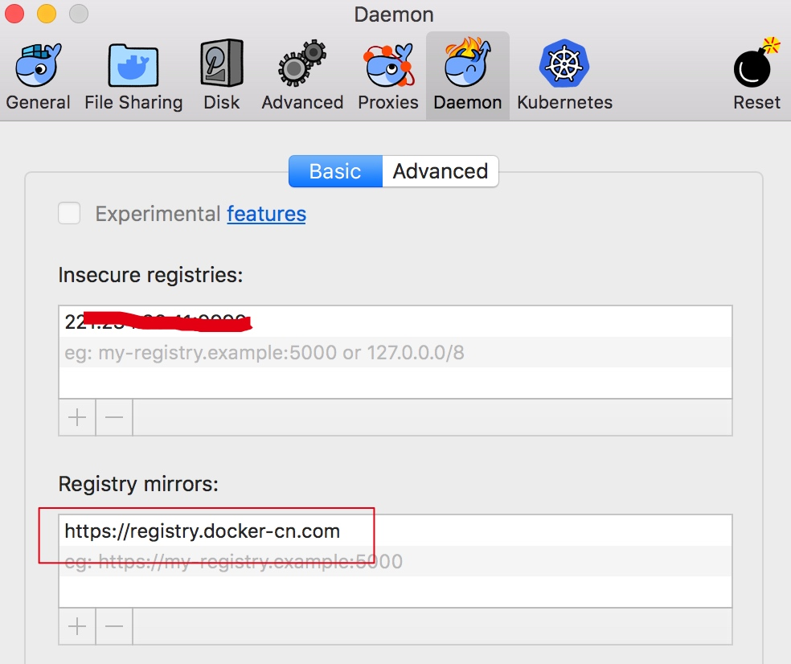
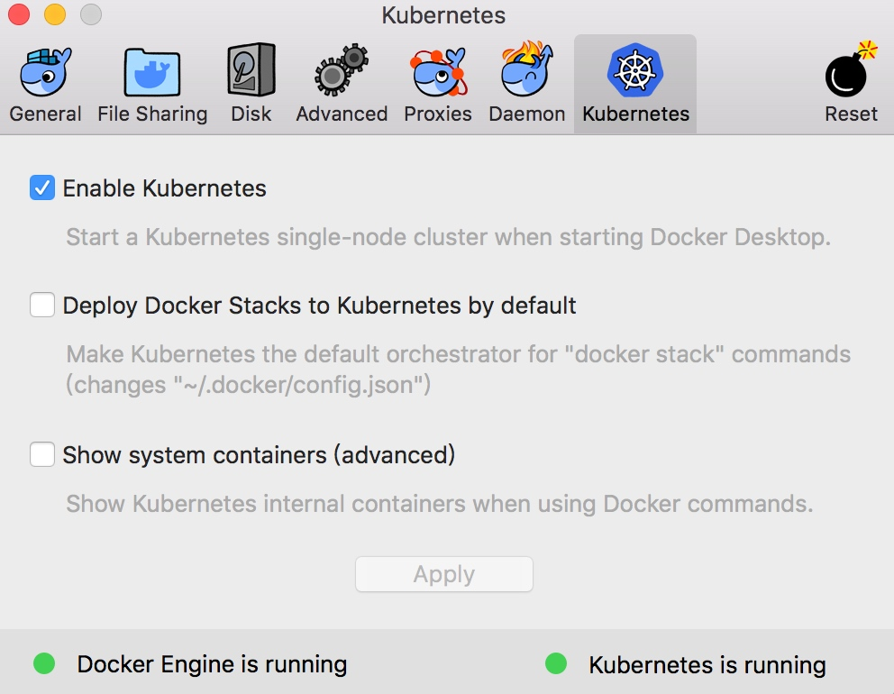
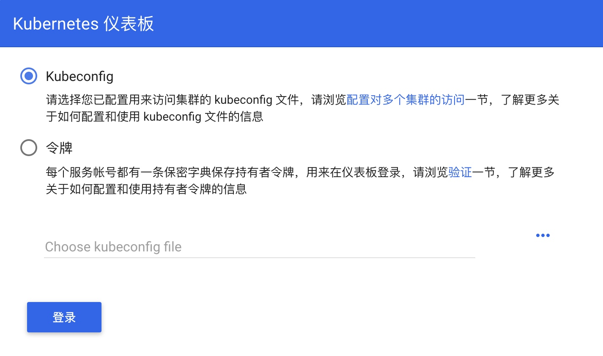
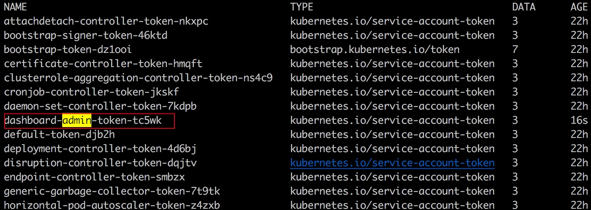
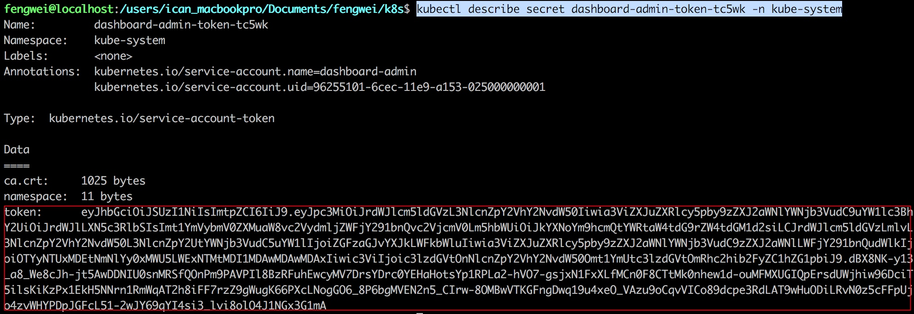
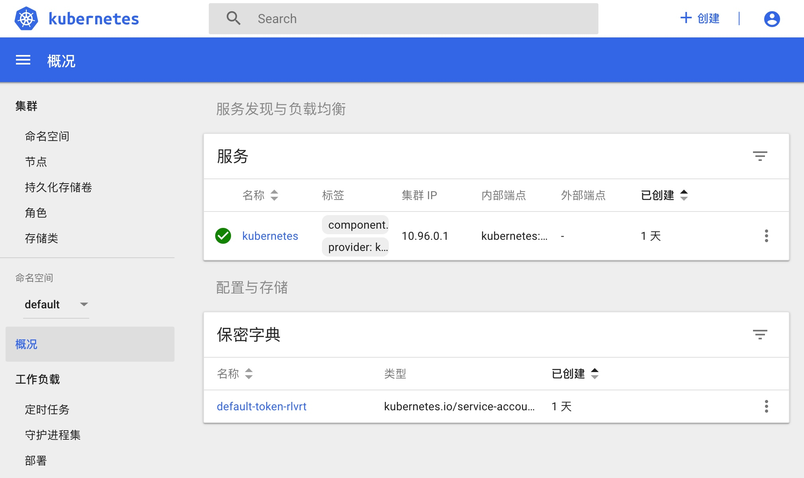

@[TOC]()
#Mac中搭建Kubernetes

## 启用Kubernetes

在Mac中安装了Docker之后，会自动安装了Kubernetes，正常情况下，
我们只需要在Docker的Preferrences->Kubernetes中勾选Enable Kubernetes，然后点击Apply按钮即可。
但由于伟大的墙的存在，这么一个简单的启动也会变得一波三折。

如果您是直接在Docker中启用Kubernetes，Kubernetes的状态会一直都是kubernetes is starting...，
原因是有一些Kubernetes依赖的镜像不能正常的下载。

Github上有个开源项目可以帮我们手动拉取镜像，执行下面命令拉去改项目代码到本地
```
git clone https://github.com/maguowei/k8s-docker-for-mac
```

在Docker中修改镜像地址为国内，如下图：


在命令行进入到k8s-docker-for-mac目录，执行sh load_images.sh就可以拉去镜像了。

且慢，如果您直接执行了上面拉取镜像的命令，还是不能正常启用Kubernetes，因为有些镜像的版本没对应上。
修改k8s-docker-for-mac目录中的images文件，将所有的v1.13.0修改为v1.10.11，因为我本机的Kubernetes版本为1.10.11。

修改完保存后，再执行sh load_images.sh拉去镜像即可。

镜像拉取完成后，勾选Enable Kubernetes，点击Apply按钮，等待几分钟，出现下图的状态表示启用成功。




## 运行dashboard

Kubernetes dashboard是一个Web界面的管理工具，如果您习惯使用命令行可以可以忽略。执行下面命令：
```
kubectl apply -f https://raw.githubusercontent.com/kubernetes/dashboard/v1.10.1/src/deploy/recommended/kubernetes-dashboard.yaml
```

kubectl proxy #默认情况下代理的是8001端口，如果要指定端口用下面命令
```
kubectl proxy --port=28080
```

执行上面命令后，会监听本机的8001的端口，这时访问
http://localhost:28080/api/v1/namespaces/kube-system/services/https:kubernetes-dashboard:/proxy/#!/login，
可以进入登录界面，如下图：



我们采用令牌的方式进行登录，首先创建管理员角色，新建一个名为k8s-admin.yaml的文件，内容如下：
```
apiVersion: v1
kind: ServiceAccount
metadata:
  name: dashboard-admin
  namespace: kube-system
---
kind: ClusterRoleBinding
apiVersion: rbac.authorization.k8s.io/v1beta1
metadata:
  name: dashboard-admin
subjects:
  - kind: ServiceAccount
    name: dashboard-admin
    namespace: kube-system
roleRef:
  kind: ClusterRole
  name: cluster-admin
  apiGroup: rbac.authorization.k8s.io
```

在命令行中进入到k8s-admin.yaml文件所在目录，执行下面命令添加管理员角色
```
kubectl create -f k8s-admin.yaml
```

获取管理员角色的secret名称
```
kubectl get secret -n kube-system
```



获取token值
```
kubectl describe secret dashboard-admin-token-tc5wk -n kube-system
```

secret后面名称就是上图中红框的名称



将登陆界面切换到令牌的模式，上图中的token值粘贴到令牌输入框中，点击登录可以进入到管理界面，如下图：



总结

学习任何一个新的知识领域，即便是很简单的一些操作流程，也会遇到各种各样的问题，解决这些问题的过程就是学习和成长。

Kubernetes的功能非常强大，不急于在一开始就弄懂所有的概念和操作命令，关键在于要动手去尝试，在一次次的尝试中积累的经验才能让你理解的更深入。

所以，接下来就要尝试将dotNetCore程序部署到Kubernetes中了。